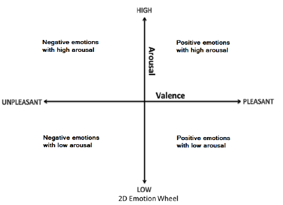
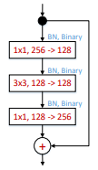
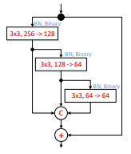
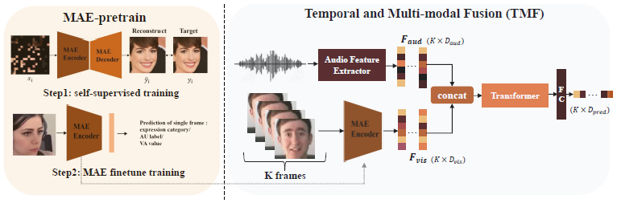
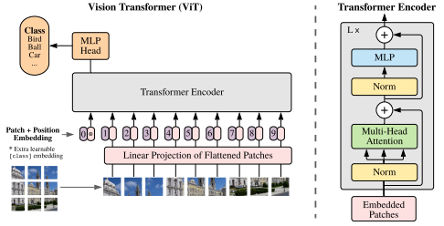
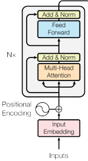

# Week 1: Understanding the Project
1. [Valence and Arousal 2D emotion wheel chart](#1-valence-and-arousal-2d-emotion-wheel-chart)
2. [Methodologies Used in the Field](#2-methodologies-used-in-the-field)
    - [Deng 2020 Research](#21-fau-facial-expressions-valence-and-arousal-a-multi-task-solution-2020)
    - [Toisoul 2021 Research](#22-estimation-of-continuous-valence-and-arousal-levels-from-faces-in-naturalistic-conditions-2021)
    - [Zhang 2023 Research](#23-multi-modal-facial-affective-analysis-based-on-masked-autoencoder-2023)
3. [Datasets to Consider](#3-datasets-to-consider)

## 1. Valence and Arousal 2D emotion wheel chart
The 2-D emotion wheel chart is used to categorise various emotions in 2 dimensions based on the pleasantness and intensity of the emotion.
- **Valence** (x-axis): Describes the extent to which an emotion is positive or negative
- **Arousal** (y-axis): Desrcibes the intensity (strength) of an associated emotional state
- For instance, a sad person will likely have negative valence but low arousal, while an angry person will likely have negative valence but high arousal.

To improve the classification of more complex emotions, some papers also reference a 3rd dimension:
- **Dominance** (z-axis): Describes how controlling (dominant) or controlled (submissive) an emotion is
- For instance, while both fear and anger are negative feelings, fear is a submissive emotion while anger is a dominant emotion.

In deriving the 2-D emotion wheel chart, there originally exists 2 school of thoughts for analysing different affective states:
1. There exists between 6 to 12 independent monopolar factors of affect
2. Affective states are related to one another in a highly systematic fashion

Since then, [Russell (1980)](https://www.researchgate.net/publication/235361517_A_Circumplex_Model_of_Affect) has shown that the latter is true, which gave rise to this 2-D bipolar categorical space. This chart will be used to categorise social media videos, but rather than assigning valence and arousal values from the [-1, 1] range, we will assign them generally to 1 of the 4 quadrants. 

  
   Figure 1: 2-D emotion wheel for Valence and Arousal

*Q: Should we train the data using the 4 categories, or should we use the continuous value and perform the classification after the output have been generated?*

## 2. Methodologies Used in the Field

### 2.1: FAU, Facial Expressions, Valence and Arousal: A Multi-task Solution (2020)

#### Aim
Train a unified model that performs predictions for FAU, facial expressions, and valence & arousal. However, note that I will only extract methodology relevant to valence-arousal analysis.

#### Dataset Used
1. FER2013
    - 48x48 pixel grayscale images of faces
    - Faces are mostly centred in the image
    - Categorised into 7 emotion categories
    - Dataset size: 35,887 images
    - Issues: Dominated by majority class "happy" (8989)
    - [Download Link](https://www.kaggle.com/c/challenges-in-representation-learning-facial-expression-recognition-challenge/data)
    - New [FER+](https://github.com/Microsoft/FERPlus?tab=readme-ov-file) dataset extension with images relabelled to include "contempt"
2. Aff-wild2 
    - Large scale in-the-wild dataset
    - Per-frame annotation for valence and arousal levels
    - Dataset size: 564 videos (about 2.8M frames), of 554 subjects
    - Need to [request](https://ibug.doc.ic.ac.uk/resources/aff-wild2/) database (14 days wait time)
3. AFEW-VA
    - Acted Facial Expressions in the Wild - Valence-Arousal (AFEW-VA)
    - Per-frame annotation for valence and arousal levels (range from -10 to 10)
    - Per-frame annotation for 68 facial landmarks
    - Clips extracted from feature films (likely to be western ethnicity biased)
    - Dataset size: 600 videos (30,051 frames)
    - Zip files can be downloaded from [here](https://ibug.doc.ic.ac.uk/resources/afew-va-database/)

#### Pre-Processing
Combine AFEW-VA and Aff-wild2 dataset:
- Rescaled valence arousal range of AFEW-VA from [-10, 10] to [-1, 1]
- Downsample Aff-wild2 dataset by 5 (reduce frames)
- Discretise into 20 bins and apply oversampling/undersampling

#### Loss Function
Defined a loss function that combines **categorical cross-entropy loss** and **Concordance Correlation Coefficient (CCC)**:
- Categorical cross-entropy loss combines both softmax activation and cross-entropy loss
- Softmax is used to scale numerical values into relative probabilities
- Cross entropy loss measures performance of classification model whose output is between 0 and 1 (probability)
- CCC measures agreement, that is the predicted and true values the axes on a scatterplot, it calculates how close the points are from the 45 degree line

#### Models
Input to both architectures below is are 112 x 112 x 3 images:
1. CNN Architecture
    - ResNet50 model (48 convolutional, 1 MaxPool, 1 average pool) as feature extractor
    - MLP model as classifier
2. CNN-RNN Architecture
    - ResNet50 model as feature extractor
    - Bi-directional GRU layers to encode temporal correlations (forward and backward)
    - MLP model as classifier

When choosing the number of layers in a ResNet model, we can first start with a smaller model such as ResNet18, then gradually increase the number of layers while balancing the trade-off between accuracy and computation. However, do note that the deeper networks may cause data to overfit.

#### Training
1. Single-Task training: Compare performance of teacher model before and after applying data-balancing techniques
2. Multi-Task training: Obtain a teacher model, and generate multiple student models (which were later had their outputs combined)

The **teacher-student model**, or knowledge distillation, transfers knowledge learnt from the larger (teacher) model to the smaller (student) model. In image analysis, the larger model could be trained to derive patterns by analysing every pixel in an image, while the smaller model would be trained on important features (shapes, contours, colours, etc.) instead. During training, the larger model will have a loss function that compares the difference between output and ground truth labels, while the smaller model will have a loss function that additionally compares the output of the larger model.

**Learning Rate**: 0.0001 with decay after every 3 epochs 
**Epochs**: 8 (teacher); 3 (student) 
**Evaluation Metric**: CCC

**Learning rate decay** is employed to help the model to converge. Initially, a large decay rate is set so that the minima can be approached faster. Subsequently, smaller decay rate is used to oscillate around a smaller region as it approaches the minima, rather than wandering away from it.

### 2.2 Estimation of continuous valence and arousal levels from faces in naturalistic conditions (2021)

#### Aim
Design a method to perform real-time continuous valence and arousal estimation from images recorded in naturalistic conditions.

#### Dataset Used
1. AffectNet
    - Image dataset annotated with discrete and continuous emotion labels
    - Includes annotation of 66 facial landmarks
    - Dataset size: > 1M images (~440K manually annotated)
    - Require academic advisor/supervisor to [download](http://mohammadmahoor.com/affectnet/)
    - Consider [Kaggle dataset](https://www.kaggle.com/datasets/noamsegal/affectnet-training-data) which is based on AffectNet-HQ (but only classifier, no valence-arousal)
2. SEWA
    - Dataset of audio and visual data
    - Includes annotation of 59 facial landmarks and continuous valence-arousal levels
    - 398 subjects from 6 cultures (British, German, Hungarian, Greek, Serbian, Chinese) of age group 20-80
    - Dataset size: > 2000 mins (33.3 hrs) of video
    - Need to [request](https://db.sewaproject.eu/) database (7 days wait time)
3. AFEW-VA
    - Refer to [Section 2.1](#21-fau-facial-expressions-valence-and-arousal-a-multi-task-solution-2020)

#### Loss Function
Defined a loss function that is a sum of four terms:
1. Categorical loss for discrete emotions
2. Loss to minimise RMSE
3. Loss to maximise PCC (Pearson)
4. Loss to maximise CCC

Note that regression loss is further regularised with shake-shake regularisation coefficients for RMSE, PCC, and CCC, with the coefficients chosen randomly and uniformly in the range of [0, 1].

Shake-shake regularisation helps to improve generalisability by replacing standard summation with a stochastic affine combination. For example:   Before regularisation: $x_{i + 1} = x_i + L(x_i, W_i^{(1)}) + L(x_i, W_i^{(2)})$
 After regularisation: $x_{i + 1} = x_i + \frac{\alpha}{\alpha + \beta} L(x_i, W_i^{(1)}) + \frac{\beta}{\alpha + \beta} L(x_i, W_i^{(2)})$

#### Model
The model developed in the paper is termed EmoFAN, and is built on top of a face-alignment network ([FAN](https://github.com/1adrianb/face-alignment)). In particular, this FAN is constructed by stacking 4 hour-glass (HG) networks, while replacing the bottleneck block with a hierachical, parallel and multi-scale block as described in [this](https://openaccess.thecvf.com/content_ICCV_2017/papers/Bulat_Binarized_Convolutional_Landmark_ICCV_2017_paper.pdf) research paper. 

Hour-Glass Network
- Many modules each consisting of a series of encoder and decoder networks
- Encoder applies convolutional and pooling layers to input image to extract features and downsample output
- Decoder applies unsampling layers to feature maps to increase resolution and refine the output

  
  
   Figure 2: Bottleneck block (left) replaced by hierachical, parallel and multi-scale block (right)

Following the FAN, 2D convolutional blocks are used to extract features using the facial landmarks. Finally, a fully connected layer is used to get the probability of each discrete emotion class, and the continuous affect dimension (valence + arousal). Note that the former is not required for our project, so we can adapt it to not require the softmax output.

### 2.3 Multi-modal Facial Affective Analysis based on Masked Autoencoder (2023)

#### Aim
Design a model that can improve the accuracy and practicality of affective analysis research in real-world scenarios, by providing annotating the Aff-wild2 database for commonly used emotion categories such as action units (AUs), basic expression categories (EXPR), and Valence-Arousal (VA).

#### Dataset Used
1. AffectNet
    - Refer to [Section 2.2](#22-estimation-of-continuous-valence-and-arousal-levels-from-faces-in-naturalistic-conditions-2021)
2. CASIA-WebFace
    - Large-scale face recognition dataset
    - Images have been cropped and aligned to approximately same size and shape
    - Dataset size: 494,000 images of 10,575 individuals
    - Downloadable from Kaggle at this [link](https://www.kaggle.com/datasets/debarghamitraroy/casia-webface)
3. CelebA
    - Large-scale face attributes dataset of celebrities
    - Each image annotated with 5 facial landmark locations and 40 binary attributes
    - Dataset size: 202,599 images of 10,177 individuals
    - Downloadble at this [link](https://mmlab.ie.cuhk.edu.hk/projects/CelebA.html)
4. iMDB-WIKI
    - Large-scale face recognition dataset from iMDB and Wikipedia
    - Includes colour and grayscale, as well as high and low resolution images
    - Dataset size: >500,000 images
    - Downloadable from Kaggle at this [link](https://www.kaggle.com/datasets/abhikjha/imdb-wiki-faces-dataset/data)

#### Loss Function
The loss function for the valence-arousal was formulated using the CCC metric: 
$L_{VA\_CCC} = 1 - CCC(\hat{v},v) + 1 - CCC(\hat{a},a)$

#### Model and Training
The following is a high level diagram of the pipeline used in this research.

  
   Figure 3: Overview of the pipeline used

1. Use masked auto-encoders (MAE) to perform self-supervised learning (SSL) to annotate the data
    - ViT used to construct the MAE: 
      
2. Replace MAE decoder with fully connected layer
    - Train model to output on VA values
3. Use finetuned MAE encoder, and pre-trained audio feature extractor models to extract both vision and acoustic features separately
4. Results are concatenated and sent into a Transformer encoder
    - Encoder composed of stack of 6 identical layers
    - Each layer composed of 2 sub-layers: (1) multi-head attention; (2) fully-connected feedforward
    - Residual (skip) connection around the layers, and a layer normalisation after each layer 
    
5. Transformer output directed towards fully connected layer to resize final output

What is a multi-head attention block?
- 1st layer: 3 linear dense layers that receive queries, keys, or values
- 2nd layer: Scaled dot-product attention $\text{Attention}(Q,K,V)=\text{softmax}\left(\frac{QK^T}{d_k}V\right)$ where $d_k$ is the dimensionality of the key vectors
- 3rd layer: Concatenation operation
- 4th layer: Linear Dense Layer

## 3. Datasets to Consider

### Currently used datasets
The following were the datasets used in the provided code:
1. OMG-Emotion: One-Minute Gradual-Emotional Behaviour, 2018
    - Annotated minute-long YouTube videos taking into account continuous emotional behaviour
    - Dataset size: 420 videos, ~10 hours
    - Refer to [csv files](https://github.com/knowledgetechnologyuhh/OMGEmotionChallenge) for YouTube links
2. CelebV-HQ: A Large-Scale Video Facial Attributes Dataset, 2022
    - Emotions annotated as per spoken/written communication
    - Dataset size: 35,666 videos of 15,653 identities
    - Download the dataset using the download tools on [Github page](https://github.com/CelebV-HQ/CelebV-HQ)
3. MEAD: Multi-view Emotional Audio-visual Dataset, 2020
    - Collection of videos of people talking with 8 different emotions and 3 different intensity levels
    - Dataset size: 48 actors' data of about 40 hours audio-visual clips each
    - Downloadable from [Google Drive](https://drive.google.com/drive/folders/1GwXP-KpWOxOenOxITTsURJZQ_1pkd4-j)

### Above mentioned datasets
1. Facial Images Datasets
    - FER2013/FER+ [(link)](https://www.kaggle.com/c/challenges-in-representation-learning-facial-expression-recognition-challenge/data)
    - AffectNet [(link)](http://mohammadmahoor.com/affectnet/)
    - CASIA-WebFace [(link)](https://www.kaggle.com/datasets/debarghamitraroy/casia-webface)
    - CelebA [(link)](https://mmlab.ie.cuhk.edu.hk/projects/CelebA.html)
    - iMDB-WIKI [(link)](https://www.kaggle.com/datasets/abhikjha/imdb-wiki-faces-dataset/data)
2. Video Datasets
    - Aff-wild2 [(link)](https://ibug.doc.ic.ac.uk/resources/aff-wild2/)
    - AFEW-VA [(link)](https://ibug.doc.ic.ac.uk/resources/afew-va-database/)
    - SEWA [(link)](https://db.sewaproject.eu/)

For facial images datasets, it is most preferable to use AffectNet due to its large datasize of over 1 million images. However, it is locked behind academia research only. It is a similar situation with the Aff-wild2 dataset with its large datasize but restricted access. An alternative is to download the other datasets and combine them instead. However, consider not combining the FER2013 dataset if RGB is part of the model analysis since the images are in greyscale.
