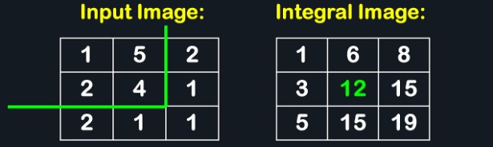
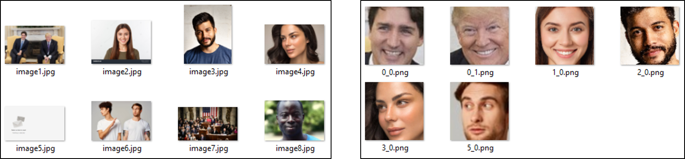
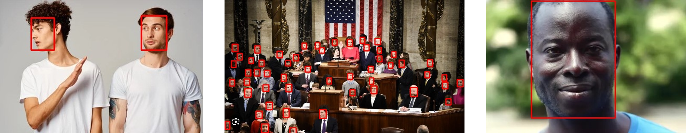
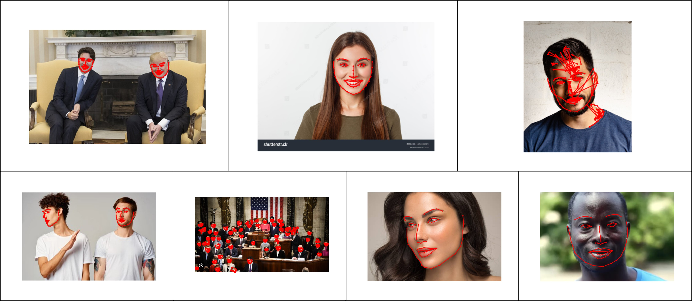

# Week 2 Preparing the Dataset
1. [Thoughts on Data Preprocessing](#thoughts-on-data-preprocessing)
2. [Haar Cascades Face Detection](#2-haar-cascades-face-detection)
3. [DSFD Face Detection](#3-dsfd-face-detection)
4. [2D and 3D Fan](#4-2d-and-3d-fan)

## 1. Thoughts on Data Preprocessing
Given that we aim to design a model that predicts valence and arousal values from videos, inputs to our model may be of a 2D/3D spatial + 1D temporal format. The goal of this week is to pre-process various datasets to fit into such a model. The proposed method is as follows:
1) Run face detection algorithm(s) to extract faces from video frames
2) Resize facial images into a standard size
2) Save extracted faces with labels (if any) into a JSON file

There are also 2 possible inputs for facial image into the model:
1) Use raw pixel data
    - Could be bloated if the images are large, or if many video frames
    - Lots of redundant information (although encoder could pick up important patterns)
2) Extract and use facial landmarks
    - Less bloated
    - May have missing or extrapolated landmarks if entire face is not visible
    - Over-simplication of information that could be extracted from a facial image
    - *Note: Supervisor has mentioned that they initially tried using facial landmarks with poor results*

Before starting with the preprocessing, we believe these are some of the potential issues that may be encountered:
- Multiple faces in a video 
    - **Problem**: How to identify similar faces across frames?
    - Save x-y coordinates of face in original image so that we can identify similar faces using some distance metric
    - Ignore the spatial component and run prediction for a single frame
- No face in video
    - **Problem**: Unsure if missing frame, undetected face, or no face?
    - Ensure that face detection algorithm is good
    - If require spatial data, could duplicate a previous frame that has a face in it

## 2. Haar Cascades Face Detection
Haar Cascades was first introduced by [Viola and Jones (2001)](https://www.cs.cmu.edu/~efros/courses/LBMV07/Papers/viola-cvpr-01.pdf) as a new approach to rapid and accurate object detection. The base algorithm utilises edge and/or line detection to identify promising regions with features for classification. While the use of Haar Cascade is still relatively popular, they are comparatively less accurate too newer facial detection models today.

The most basic filters used in Haar Cascades are known as Haar features. These are rectangular filters that are used to find lines, edges, or pixel intensity changes in images. From the basic filters, the training process will derive complex classifiers that can identify facial features with high detection rates and low false positive rates. On new images, multiple classifiers in separate stages will begin scanning from the top left to the bottom right in a sliding window fashion. The classifier will compute a sum for each step in the sliding window, and if at any point it exceeds a defined threshold, it will be filtered as a potential face.

  
   Figure 1: Example Haar features used on facial image

Having to repeatedly calculate the sum of pixel values in a rectangle over many windows and classifiers can be very inefficient. Hence, integral images were proposed to store the summation of pixels in a specific way, such that the sum of pixels in any rectangle can be computed in constant time. Given a pixel with coordinate (x, y), the integral image value at that location is the sum of all pixels in a rectangle from (0, 0) to (x, y). 

With a complete integral image is computed, the pixel sum of any rectangle in the original image may be computed. Assume the corners of the rectangle is of the coordinate point, A-B-C-D, from top left - top right - bottom left - bottom right, then the sum of pixels in that rectangle is given as:

$$ \text{sum} = A + D - B - C $$ 

  
   Figure 2: Computation of an integral image (1 + 5 + 2 + 4 = 12)

The workflow of our [code](https://github.com/DJ-Tan/DSO_Internship_JanApr24/blob/Week-2/Week%202%20(Preparing%20the%20Dataset)/Extract%20Face%20(Dumb)/extract_face.py) is as follows:
1) Read in directory of images/videos
2) For videos, extract all frames and treat them as images to be processed
3) For each image, use Haar Cascade face detection to identify faces and crop them out
4) For each face, use Haar Cascade eye detection to align the faces (line joining both eyes is horizontal to image)
5) Scale down image to a standard processing size
6) Save images in a directory

From the result shown in Figure 3 below, it is observed that the facial detection algorithm performs rather poorly. The shortcomings can be summarised as follows:
- unable to detect sideview faces (image 6)
- unable to detect faces of a low resolution (image 7)
- unable to detect faces with low pixel value contrast (image 8)

Furthermore, it was also observed that none of the images were rotated to be aligned. When testing the eye detection model, there were many instances where no eyes or more than 2 eyes were detected. For the cases with greater than 2 eyes, the actual eyes were usually part of those detected. However, if the alignment occurred on a falsely detected "eye", the rotation would be immensely off. Hence, the threshold was intentionally set high to only allow rotation when 2 eyes were detected.

  
   Figure 3: Input images to the program (left) and output faces (right)

In conclusion, for the purposes of this project where people portraits were unlikely to be the image input, it was decided that other face detection algorithm over this primitive.

## 3. DSFD Face Detection
The dual-shot face detector (DSFD) is based on a [2019 paper](#https://openaccess.thecvf.com/content_CVPR_2019/papers/Li_DSFD_Dual_Shot_Face_Detector_CVPR_2019_paper.pdf) that aims to design a novel face detection network superior to other face detectors of its time. The model is named as such since it there are a first shot detection layer is constructed from the original input to create 6 feature maps, while a second shot detection layer is further transformed into 6 enhanced feature maps. The model's detection rate is immensely better than that of Haar Cascades, being able to detect faces regardless of occlusions, blurriness, illumination and reflection, but comes at the cost of extremely slow inference speed.

The workflow of our [code](https://github.com/DJ-Tan/DSO_Internship_JanApr24/blob/Week-2/Week%202%20(Preparing%20the%20Dataset)/Extract%20Face%20(DFSD)/extract_face2.py) is similar to that of the Haar Cascades, with the detector swapped out to that of DSFD. It should be noted that the DSFD used is a variation of the original model that improves the inference speed by 30 times.

Figure 4 below shows a drastic improvement when using DSFD over Haar Cascades:
- Left image: Variation with pose (half-face visible)
- Center image: Variation with scale (many people)
- Right image: Variation with visual modality (darker skinned) 

It is noted that for the center image, the algorithm failed to capture the faces of a few individuals. This is likely the result of specifying too high a confidence threshold (>0.9). Regardless, it is unlikely that we will encounter such scaled out photos, since we are focusing more on social media clips where there is usually 1 person of interest in the main frame.

  
   Figure 4: Improved face detection output using DSFD

We went on to use DSFD on the [AFEW-VA dataset](https://ibug.doc.ic.ac.uk/resources/afew-va-database/) and save the extracted images along with the VA values into 1 JSON file per clip. Note that the zip file containing the JSON files were not uploaded due to size constraints, but the code used to extract can be found in the *Extract AFEW-VA* directory.

## 4. 2D and 3D FAN
In this section, the focus is on using a pre-existing face alignment network (FAN) to detect facial landmarks in the 2D and 3D space. Note that the FAN algorithm is originally intended to identify geometric structures of faces so that various transformations may be performed to align (center) the image, ensuring consistency across the image dataset.

The face recognition [code](https://github.com/1adrianb/face-alignment) was tested on 8 images to verify its general performance. We note the following:
- Algorithm managed to identify every face in the images regardless of occlusion, scale, lighting, etc.
- Faces cropped out by the image had the rest of their landmarks extrapolated
- Single instance where "faces" were identified when they did not exist (top row 3rd image)

  
   Figure 5: 2D facial landmarks appended on original images

When we choose to extract facial landmarks and feed that as input to our deep learning model, the advantage is the reduced number of input nodes which would improve efficiency. However, we stand to miss out on potential features which cannot be described by facial landmarks alone. Hence in the given code, a masked autoencoder was used to extract relevant features from the frames of a video. 
