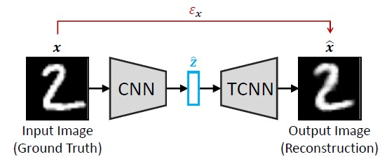

# Week 3 Auto Encoders
1. [Introduction to Auto-Encoder](#1-introduction-to-auto-encoder)
2. [Auto-Encoder for Video Processing](#2-auto-encoder-for-video-processing)

## 1. Introduction to Auto-Encoder
Auto-Encoders (AEs) are a type of unsupervised artificial neural network that learns to efficiently encode unlabelled data by reducing the innput dimensions, followed by attempts to reconstruct the original input from the compressed data.

The following are some types of AEs:
1. Plain AEs
    - Middle (hidden) layer has same number of nodes as input and output layers
    - Not commonly used since the goal is to reconstruct output using a reduced representation
2. AEs with bottleneck
    - Hidden layer has less nodes than input/output layers
    - Reduced dimensionality of input while retaining important features
3. Sparse AEs
    - Introduce a sparsity regularisation term to encourage activation of a subset of neurons in the hidden layer
    - Let autoencoder decide number of nodes to be activated for hidden layer instead of pre-setting a fixed number
4. Deep AEs
    - Encoder composed of multiple dense (fully connected) hidden layers that progressively applies transformation to reduce dimensionality of input data
    - Latent vector (bottleneck) that contains most compressed (reduced) representation of input data
    - Decoder that inversely mirrors the encoder, with dense hidden layers that gradually increase dimensionality of latent vector to reconstruct original image
    - Used to learn complex and hierachical patterns in input data 
5. Deep convolutional AEs
    - Overall structure of encoder -> latent vector -> decoder similar to that of deep AEs
    - Encoder/Decoder now comprises of multiple convolutional layers, with each layer performing convolutional operations with trainable filters
    - Used in image-related tasks to capture local patterns and spatial hierachies

  
   Figure 1: Overview of deep convolutional AE used for image reconstruction

If we choose to use facial landmarks as our input data, then it would be sufficient to train a sparse or deep AE. However, if we were to use pixel data for an entire face, deep convolutional AEs would be preferred. For the purposes of this project, we will be using deep convolutional AEs.

The following are some applications of AEs:
1. Feature representation learning
    - Used when lots of unlabelled data and very few labelled data
    - Train AE on unlabelled data to get latent vector
    - Discard the decoder part of the AE
    - Use latent vector (reduced representation) to train another model
2. Anomaly detection
    - Used for error analysis when identifying irregular behaviour is not trivial
    - Train AE to reconstruct normal data instances very well
    - When AE encounters anomaly, reconstruction will be bad and error is high (difference between original input and reconstruction exceeds threshold)
3. Robust learning
    - Used when input data is not diverse or size is too small
    - Introduce noise to input data before passing to AE
    - Examples of noise includes: Gaussian or Poisson noise, salt and pepper noise, random walk noise
    - Introduce image transformations: geometric, affine, flipping, blurring, color, shearing
4. Variational AEs in generative data synthesis
    - Used in creative tasks for generating novel realistic data
    - Instead of single points in the latent vector, a latent space where each "point" is a probability distribution (normal) is used

  
   Figure 2: Applying transformations to generate noisy input

We are likely to consider performing transformations on the input, since although the AFEW-VA [dataset](https://ibug.doc.ic.ac.uk/resources/afew-va-database/) has 600 video clips of frames ranging from 20 to 100 each, we are only referencing 1 face per each clip. Furthermore, these are faces of actors taken from blockbuster movies, which are unlikely to have many Asian faces.

## 2. Auto-Encoder for Video Processing
Video AEs are an extension of traditional AEs where a 3rd temporal dimension is used to learn about video sequencecs. This means that a 3D convolutional layers are used over the 2D ones. The goal is that given a sequence of frames, the next frame in the sequence may be predicted. Alternatively, RNNs and LSTMs may be used to augment the convolutional layers to capture these temporal dependencies.

### VideoMAE (2022)
https://github.com/MCG-NJU/VideoMAE

### Diffusion Video Autoencoder (2023)
https://github.com/man805/Diffusion-Video-Autoencoders

### MARLIN (2023)
https://github.com/ControlNet/MARLIN
