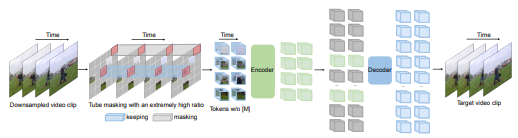
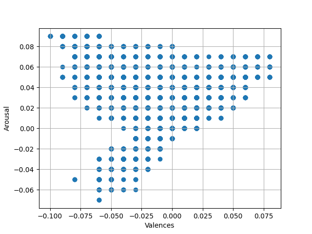

# Week 6: VideoMAE
1. [What is VideoMAE?](#1-what-is-videomae)
2. [Testing AFEW-VA dataset on fine-tuned VideoMAE](#2-testing-afew-va-dataset-on-fine-tuned-videomae)
3. [VideoMAE + MLP](#3-videomae--mlp)
4. [TimeSformer and ViViT](#4-timesformer-and-vivit)

## 1. What is VideoMAE?
VideoMAE ([Z. Tong 2022](https://arxiv.org/pdf/2203.12602.pdf)) is a type of masked autoencoder that performs self-supervised video pre-training (SSVP), where the goal is to extract effective video representations during the pre-training process. VideoMAE was inspired by ImageMAE which attempts to reconstruct masked pixels, but for images instead of video sequences. Specifically, VideoMAE masks random pixels cubes in frames of a video sequence, and attempts to reconstruct these missing pixels with an asymmetric encoder-decoder architecture. The overview of the architecture is shown below:

  
   Figure 1: Model architecture of VideoMAE

The following were issues considered when moving from ImageMAE to VideoMAE:
1. Size of video datasets pales in comparison to that of image datasets
    - Insufficient data to effectively train the model
    - Self-supervised learning is meant for large datasets
2. Consecutive frames of video clips tend to be similar (video with high fps)
    - Data leakage during reconstruction of frames
    - Need to factor in temporal dimension when training the model
Note that the second problem can be used to fix the first problem, since owing to the high repetitive information between consecutive frames, a high masking ratio (not possible with individual images) could be used. As for the second problem, tube masking is used, which is when all frames have the same masking map.

## 2. Testing AFEW-VA dataset on fine-tuned VideoMAE
With the processed AFEW-VA dataset using DSFD from previous weeks, the goal in this section is to fine-tune the pre-trained VideoMAE base model to predict the Valence-Arousal quadrant of the AFEW-VA dataset, with guidance from [this notebook](https://github.com/huggingface/notebooks/blob/main/examples/video_classification.ipynb). The following were some modifications made to the model:
1. VideoMAEForVideoClassification used instead of VideoMAEModel
    - Reason: Allow outputs for 1 of 4 class labels
    - 1, 2, 3, 4 corresponding to top left, top right, bottom left, bottom right quadrants
2. 7 frames per sequence used instead of 16
    - Reason: Some videos in the dataset have very little frames
    - Construction of sequence involves taking a context window of size _x_ frames, which means possibly taking duplicates of frames before and after the first and last frames respectively
    - If too many frames in a sequence are duplicated, VideoMAE becomes like ImageMAE?
3. Frame image size of 256×256 used instead of 224×224
    - Reason: Dataset was already preprocessed as such
    - Images are downscaled during the training process

Train-test split:
- 8:2 ratio - 480 videos for train, 120 videos for test
- Each video of varying length, so varying number of sequences extracted
- Severe class imbalance where single digit number of videos belongs to quadrant 4 (see image below) - expected since expressions of actors in movies tend to be more exaggerated

  
   Figure 2: Scatterplot distribution of AFEW-VA dataset

Results of the fine-tuned model is as follows:
| Metric   | Score  |
| :------: | :----: |
| Accuracy | 0.5005 |
| Macro F1 | 0.2206 |

While the accuracy is performing twice as well as compared to chance (0.5005 > 0.2500), the macro-f1 score is very low (0.2206 << 0.5000), indicating a model with low performance. This is expected since an overwhelming majority of data belongs to quadrant 1, while little to no data belongs to quadrant 4. Oversampling for minority class is also not optimal since there are less than 10 datapoints to extrapolate from. To proceed with this approach, it is recommended to find other video datasets to make up for the imbalance.

## 3. VideoMAE + MLP
An alternative approach explored for VideoMAE was to use the forward pass (last_hidden_states) and feed it into a self-designed MLP model that could output values for Valence and Arousal (between -1 and 1) instead of specific class labels (1, 2, 3, 4).

The model architecture used is as follows:
- 1 input layer, 3 hidden layers, 1 output layer
- **ReLU** activation function for all layers except last layer that uses **Tanh**
- Dropout layers between each layer
- Note that the best combination for number of nodes and dropout probability for each approach was determined using GridSearchCV

Note that the forward pass of VideoMAE gives an output of shape 1568×768, which is slightly over 1.2 million features to feed into the MLP model. This is unacceptable since with such a large number of input features, there will be data sparsity, and the 3 hidden layers will struggle to learn any underlying patterns from the input data. Preferably, the first hidden layer should accept more nodes than the number of input features. 

Two approaches were considered to solve the issue of high dimensional input:
1. Take the mean value for each column -> 1568 features
2. Use PCA to project the data to a lower dimensional space -> 100 features

Since the MLP model directly outputs the Concordance Correlation Coefficient (CCC) score, this metric was used to measure performance over accuracy or macro F1-score. In addition, since the goal is to maximise both valence and arousal score, the model is trained to maximise the mean of valence and arousal.

| Approach | Configuration | CCC (mean) |
| :------: | :-----------: | :--------: |
| Mean value for each column | Nodes: [1568, 256, 128, 64, 32, 2] Dropout: [0.70, 0.65, 0.60, 0.55] | 0.00008 |
| PCA to 100 components| Nodes: [1024, 512, 256, 128]  Dropout: [0.8, 0.75, 0.7, 0.65] | -0.00039 |

The mean CCC score of 0 reported above suggests that:
1. There is no linear relationship between the model prediction and the true labels
2. Model prediction does not agree with the true labels

The possible reasons for having a poor CCC score is:
- Output of VideoMAE was forwarded to a poorly design MLP model
- VideoMAE is not suited to this task
- Dataset chosen is of a poor quality

## 4. TimeSformer and ViViT 

To test whether the suitability of VideoMAE for this task, the VideoMAE model was bbenchmarked against 2 other video models on the HuggingFace repository, ViViT and TimeSformer.

### Model 1: TimeSformer
As implied by the name, TimeSformer adopts the Transformer architecture to learn spatiotemporal features from a sequence of frame-level patches. There are 5 parts to the architecture:

| Component | Description |
| :-------: | :---------- |
| Input encoding | Each frame of an input sequence is divided into 16 x 16 patches, representing a token, where these tokens are encoded into some vector to be used as embeddings |
| Temporal encoding | Relative position of the token in the sequence is included as part of the embedding |
| Temporal self-attention mechanism | Allow the model to attend to different parts of the sequence, picking out the most relevant frames in terms of temporal and pixel dependencies |
| Temporal position-wise feedforward networks | 1-hidden-layer MLP is applied at the end of the attention layer to allow the model to learn the complex temporal patterns |
| Output layer | Altered depending on the type of task required |

### Model 2: ViViT
Video Vision Transformer (ViViT) is another model that uses a Transformer architecture, that operates rather similarly to TimeSformer. However, there is a key difference in the architecture:
- ViViT: Each frame of a sequence is treated by a 2D spatial transformer separately, and subsequently aggregated acroos frames to learn temporal information
- TimSformer: Temporal relationships is specifically modelled through the use of temporal self-attention mechanisms, meaning that spatial and temporal information are processed simulataneously

### Results of Transformers + MLP

| Model | Approach | Configuration | CCC (mean) |
| :---: | :------: | :-----------: | :--------: |
| TimeSformer | Mean value for each column | Nodes: [1024, 512, 256, 128] Dropout: [0.8, 0.7, 0.6, 0.5] | 0.1959 |
| TimeSformer | PCA to 100 components | Nodes: [1024, 512, 256, 128] Dropout: [0.8, 0.75, 0.7, 0.65] | 0.0177 |
| ViViT | Mean value for each column | Nodes: [1024, 512, 256, 128] Dropout : [0.8, 0.75, 0.7, 0.65] | 0.0498 |
| ViViT | PCA to 100 components | Nodes: [256, 128, 64, 32] Dropout: [0.8, 0.7, 0.6, 0.5] | -0.0504 |

When compared to masked auto-encoders, there seems to be an improvement in model performance. A possible explanation is that the self-attention mechanism perfroms better in helping the model to learn the relevant features over using encoders. Note that the results shown here are from the pretrained Kinetics400 dataset (human action video dataset), rather than specific facial image sequences. Moving forward, the TimeSformer will be used for video component of this project.

This week also marks the end of video component of the model. In subsequent weeks, the audio component of the model will be tested. The goal is to first test the Wav2Vec2 model used in the original model, and try out the Whisper model as suggested by my supervisor.
