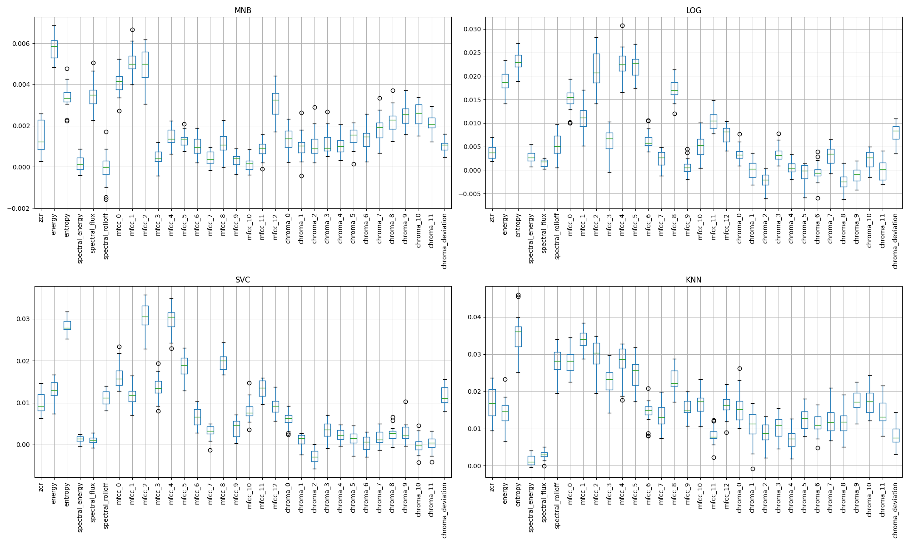
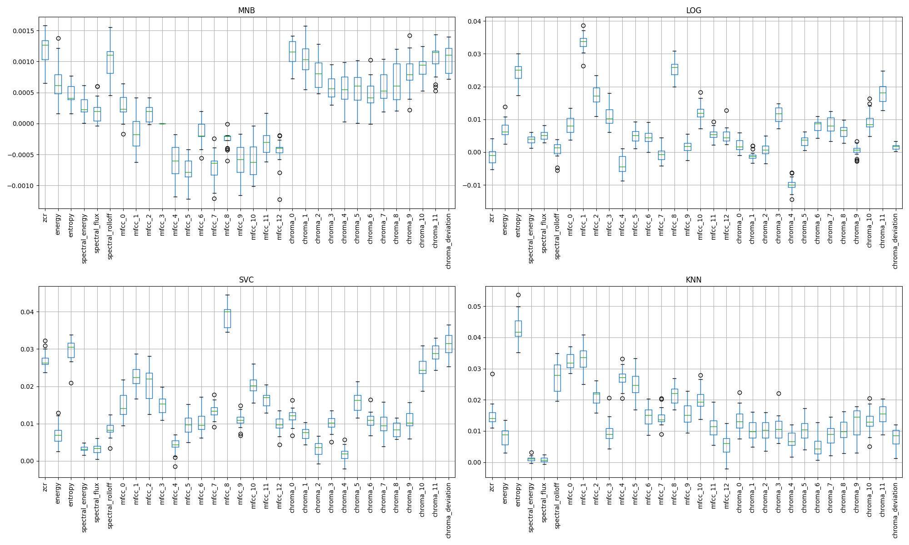

# Week 7: Speech Emotion Recognition (SER)
1. [Audio Emotion Recognition](#1-audio-emotion-recognition)
2. [Dataset](#2-dataset-corpus)
3. [Feature Extraction](#3-feature-extraction)
4. [Model Analysis](#4-model-analysis)
5. [Future Works](#5-future-works)

## 1. Audio Emotion Recognition
Audio emotion recognition is the analysis of audio waveforms to infer the emotion most closely related to the audio clip. In particular, there are three types of audio emotion recognition:

1. Speech Emotion Recognition (SER):
    - Analysis of spoken language and vocal signals.
    - Features include pitch, intensity, and tone.
    - May include analysis of linguistic content (e.g., words and sentence structure), which would be more similar to a Natural Language Processing (NLP) task.
2. Music Emotion Recognition:
    - Analysis of instrumental or vocal music.
    - Tends to have many unique features to investigate, including tonal features, rhythmic features, and temporal features.
    - Labelled datasets are readily available, as many music tracks have existing classifications to cater to user preferences.
3. Soundscape Emotion Recognition:
    - Analysis of background noise or random sounds.
    - Somewhat ambiguous, as these noises tend to lack context.
    - Sounds may not even be generated by humans, and hence should not have any emotions attached to them.

For this study, the focus will be on SER since we are attempting to investigate social media videos of people talking.

## 2. Dataset (Corpus)
The ASVP-ESD dataset was used for this study, and be downloaded from this [Kaggle page](https://www.kaggle.com/datasets/dejolilandry/asvpesdspeech-nonspeech-emotional-utterances/). This dataset consists of various speech and non-speech sounds labelled with emotions from 13 different categories. The sounds were collected from various online platforms, movies, and real-world communication recordings from a total of 129 actors. Refer to these [statistics](statistics.txt) for the full breakdown of the corpus.

Before performing feature extraction, various audio files were filtered out due to the lack of clarity. In particular, files that had the following properties were filtered out:
- Had "Breath" as it's labelled emotion
- Had emotions of unknown intensity levels
- Had actors of unknown ages
- Had unknown sources of downloads
- Clip duration of less than 1 second
- Clip duration of more than 10 seconds

The reason for rejecting clips lesser than 1 second was to ensure that there was sufficient context for meaningful features to be extracted. Clips greater than 10 seconds were also rejected, since the goal was to eventually apply a Transformer architecture model (in Week 8), and this would reduce the amount of truncation performed when tokenization has to be done.

Following the filtering process, preprocessing was performed on all data. All audio clips were resampled to a frequency of 16kHz, which is a standard analysis rate for many ML models. A Butterworth lowpass filter was then used to filter out high frequency background noise. 

## 3. Feature Extraction
The features chosen were derived from a [GitHub repository](https://github.com/tyiannak/pyAudioAnalysis/wiki/3.-Feature-Extraction) that implements various short-term features that could be extracted. However, due to the library incompatibilities, I instead performed the extraction myself using the *librosa* Python package for music and audio analysis.

The features extracted are as follows:
| Feature | Description | What is shows? |
| :-----: | :---------- | :------------- |
| Zero Crossing Rate | Measures rate at which a signal changes sign | High ZCR rate indicates that the signal changes rapidly, while a low ZCR rate indicates stability |
| Energy | Represents the magnitude of a signal | High energy indicates louder or more intense sounds, while low energy indicates softer or milder sounds |
| Entropy of Energy | Measures randomness of energy distribution | High entropy indicates signal with wide range of intensity levels, while low entropy indicates more uniform distribution |
| Spectral Centroid | Represents average frequency weighted by spectral magnitude | High centroid indicates higher-frequency audio waveforms, while low centroid indicates low-frequency audio content |
| Spectral Spread | Measures dispersion of spectral energy around spectral centroid | High spread indicates wider range of frequencies, while low spread indicates smaller range of frequencies |
| Spectral Flux | Measures rate of change of spectral content of consecutive frames | High flux indicates more significant change, while low flux indicates better stability |
| Spectral Rolloff | Represents frequency below a percentage (85%) of spectral energy | High rolloff indicates more energy is concentrated at lower frequencies, while low rolloff indicates a more even distribution of energy |
| Mid-frequency Cepstral Coefficients (MFCC) | Represent short-term power spectrum of a signal | Captures spectral characteristics of a signal which can be perceived by human hearing |
| Chroma Vector | Measures distribution of energy across 12 pitch classes of the musical octave | Captures harmonic content and tone of a signal |
| Chroma Deviation | Measures deviation of chroma vector from a chroma profile | High deviation indicates divergence from profile, while low deviation indicates higher similarity | 

## 4. Model Analysis
In order to determine which features are the most impactful, the model inspection technique, permutation feature importance, was used. The function iterates through all the features, where during each iteration one feature's value is permuted *n_repeats* number of times while keeping all other features' value constant. The change in model's performance is then recorded across all *n_repeats* and for all features. A large drop in model's performance would indicate that the feature is important, since the model performs poorly when the feature's value is altered. 

For this study, 4 baseline models were used to determine feature importance: Multinomial Naive Bayes (MNB), Logistic Regression (LOG), Support Vector Classification (SVC), K-Nearest Neighbour (KNN). The plot of permutation importance for each of these baseline models are as shown in Figure 1. Note that the y-axis represents the drop in macro F1-score, while the x-axis represents the features.

  
   Figure 1: Box and whisker plot showing importance of each feature given 4 different models before label remapping

From the plot, notice that there exists no feature which is clearly "unimportant" towards the classification, that is permuting the features lead to an clear improvement in macro F1-score. Hence, it was decided that if >50% of the feature's permutation was led to an increase in performance, those features would be dropped. It should be noted that those features considered "unimportant" for this current dataset may be important for other datasets. Hence, any conclusions drawn should be limited to this dataset rather than be generalised. The table below shows the performance before and after the features were dropped.

| Model | F1-score (before) | Features Dropped     | F1-score (after) |
| :---: | :---------------: | :------------------: | :--------------: |
| MNB   | 0.10534           | Spectral Rolloff     | 0.10373          |
| LOG   | 0.27010           | Chroma 2, 5, 6, 8, 9 | 0.26776          |
| SVC   | 0.30735           | Chroma 2, 10         | 0.30679          |
| KNN   | 0.31966           | -                    | 0.31966          |

The reasons why various features may be less important is as follows:
- Spectral Rolloff - Applying the lowpass filter created a more even energy distribution
- Chroma Vectors - Dataset focuses on speech rather than musical content

Note that in all instances of dropping the features, the model performed slightly worse. This could be the result of data sparsity due to the large number of emotion categories that the models had to classify. To solve this issue, each of the emotion categories were remapped into 1 of 4 quadrants on the Valence-Arousal chart, as well as an additional category for neutral emotions. 

The mapping is as follows:
- Category 0: Excited, Pleasure
- Category 1: Happy, Laugh, Gaggle, Surprised, Gasp, Amazed
- Category 2: Boredom, Sigh, Disgust, Dislike, Contempt, Disappointment, Disapproval
- Category 3: Sad, Cry, Angry, Grunt, Frustration, Fearful, Scream, Panic, Pain, Groan
- Category 4: Neutral, Calm

  
   Figure 2: Box and whisker plot showing importance of each feature given 4 different models after label remapping

The table below shows the models' performance after the remapping of emotion categories:

| Model | F1-score (before) | Features Dropped            | F1-score (after) |
| :---: | :---------------: | :-------------------------: | :--------------: |
| MNB   | 0.11863           | MFCC 1, 4 - 12              | 0.11864          |
| LOG   | 0.33658           | ZCR, MFCC 4, 7, Chroma 1, 4 | 0.32798          |
| SVC   | 0.35896           | -                           | 0.35896          |
| KNN   | 0.44024           | -                           | 0.44024          |

Observe that the F1-score across all models improved after the remapping, which implies that data sparsity was likely to be the issue. However, note that there is still likely a lot of misclassifications given that the highest macro F1-score is still relatively low. This is to be expected since the classification has been reduced to grouping by the polarity of valence and arousal, where the intensity is ignored.

The reasons why various features may be less important is as follows:
- MFCC - By combining audio of varying intensities, the signals become less distinct
- ZCR - Arousal is likely related to ZCR, since the speech tends to more exaggerated. However, after combining classes, there is a wider range of arousal in each class, which makes the feature less relevant
- Chroma Vectors - Dataset focuses on speech rather than musical content

Another observation made is that K-NN is the best performing baseline model. This is likely due to the non-parametric nature of K-NN, where no assumptions are made on the data's distribution, unlike say Logistic Regression which assumes linearity between features. Furthermore, K-NN is robust against noise and outliers, which is the case for many emotion datasets. 

## 5. Future Works
In the following week, the goal is to use a model with Transformer architecture to generate features relevant to our dataset, and see if augmenting these features to our manually extracted features would improve the model's performance.

Other improvements to the study that could be considered are:
- Remapping that considers the emotion intensity
- Split longer clips into shorter clips to obtain more datapoints
- Augmenting the dataset with other datasets (open-source datasets of this nature are difficult to find due to copyright)
- Consider using LIME as an alternate analysis tool
