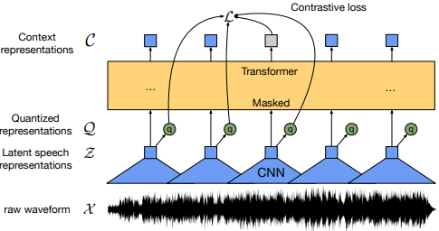
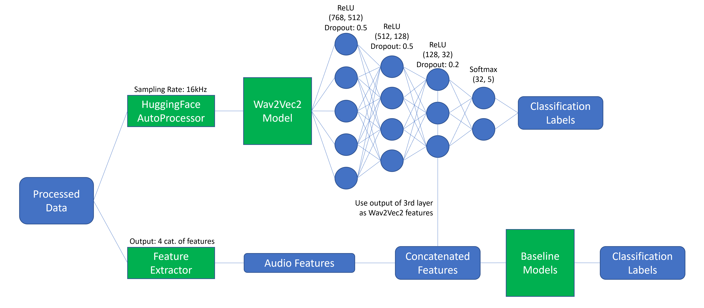

# Week 8: Wav2Vec2
1. [Introduction to Wav2Vec2](#1-introduction-to-wav2vec2)
2. [Wav2Vec2Classifier Model](#2-wav2vec2classifier-model)
3. [Learning Points and Takeaways](#3-learning-points-and-takeaways)

## 1. Introduction to Wav2Vec2
Waveform-to-Vector 2, or Wav2Vec2, was a speech representation learning model released in 2020. The model uses a Transformer architecture and Convolutional Neural Networks to encode raw waveforms as context vectors. The overall framework of the model is as follows:
1. Feature Encoder
    - Responsible for encoding raw waveform input into meaningful feature representation
    - Consists of multiple temporal convolution blocks, followed by layer normalization and a GELU (Gaussian Error Linear Unit, used for standard normal distribution) activation function
2. Transformers
    - Processes output of feature encoder using a context network with a Transformer architecture
    - Modification: Uses convolutional layers to generate relative positional embeddings as opposed to standard aboslute positional embeddings
3. Quantization Module
    - Discretizes the continuous representation of the feature encoder's output to be used for self-supervised training
    - Discretized output is saved into a "codebook"
    - During product quantization, the closest quantized representation from each "codebook" is concatenated to form a final quantized representation

  
   Figure 1: Overall framework of Wav2Vec2 Model

## 2. Wav2Vec2Classifier Model
Before feeding the processed data into the Wav2Vec2 model, an AutoProcessor was used to standardize the input sequence size to a tensor of size 16,000. An MLP model was then attached to its last hidden states to serve as the classification head. The MLP has 4 layers, with the nodes going from 768 -> 512 -> 128 -> 32 -> 5, where each layer uses a ReLU activation function, except the last layer that uses a SoftMax.

The following table shows the classification report of the model before and after the remapping of emotion classes. Interestingly, there were some classes that had no correct predictions, contributing to the low macro F1-score. The common trend among all these classes was that they had the least number of data points, suggesting that the Wav2Vec2 model likely had insufficient data to train on.

| Setup          | Accuracy | F1-Score | Classes with no correct predictions |
| :------------: | :------: | :------: | :---------------------------------: |
| Before Mapping | 0.20377  | 0.05908  | 1, 2, 5, 6, 7, 9, 10, 11, 12        |
| After Mapping  | 0.40702  | 0.14675  | 0, 2, 4                             |

  
   Figure 2: Overall framework of Wav2Vec2Classifier Model

Originally, the goal was to concatenate the features learnt by the Wav2Vec2Classifier model with the audio features extracted in Week 7 to improve the model. However, the F1-score for the Wav2Vec2Classifier was at least 3 times worse than the performance of the baseline models using only the audio features.

There are several things we could try to improve the model with:
- Fine-tune the Wav2Vec2 model on a larger dataset to learn a better "codebook"
- Train the MLP portion of the framework with deeper layers to learn more complex features
- Train the MLP portion of the framework over more epochs (risk overfitting)
- Consider using Wav2Vec2FeatureExtractor instead of attaching our own classification head

## 3. Learning Points and Takeaways
Being the final week of my DSO internship, I would like to express some of my thoughts on this project.

I came into the internship with very little experience in ML projects, having only taken a single introductory ML module prior to this. This lack of experience is evident in the work done in the earlier stages of the internship, where I skipped parts of the ML pipeline to obtain the best results by testing various models. However, I eventually realized that achieving good results was not as important as understanding why I was obtaining those results. After all, if we cannot deduce which factors are contributing to a model's performance, it becomes difficult when we want to replicate the performance using other datasets or models.

I also found that the hardest part of the project was not in model training, but rather in setting up the model. Finding usable emotion datasets was challenging, as many of these were locked behind educational institutes, and many open-source ones were poorly formatted. Next was preprocessing the raw data into a form that was accepted by the various deep learning or neural network models. This meant understanding the code documentation, especially for those models not hosted on the HuggingFace platform. Although many of the models used could learn features by themselves, I took it upon myself to also include manually engineered features to understand how models would perform with them. That way, meaningful feature analysis could be performed. Finally, model training always took a long time depending on the size of the dataset and models used, ranging from a few hours to a day. This meant that I had to do a good job in setting up the data; otherwise, any errors would be computationally costly.

In conclusion, I am thankful for the opportunity to do this Computer Vision internship at DSO. It gave me great insight into the life of an AI/ML engineer, which I have to admit, while frustrating at times, was mostly a fulfilling and enjoyable experience.
